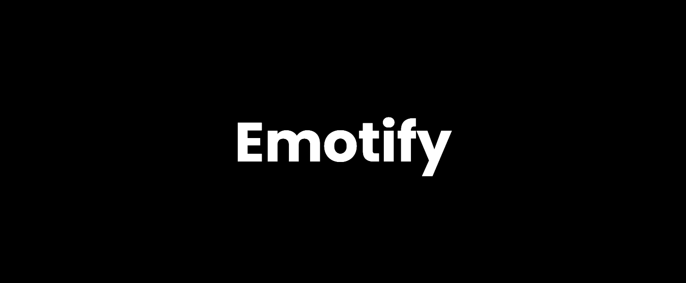

<h3 style="text-align: center;">
  A JavaScript library that lets you add custom emotes into your website.
</h3>
<br>

## Getting Started

1. Include the Emotify script.
```
<script src="https://cdn.jsdelivr.net/gh/aryanbaburajan/emotify/src/emotify.min.js"></script>
```

2. Create custom emotes.
```
emotify.addEmote({ "blobhype": "https://cdn.discordapp.com/emojis/833742785198424084.gif" });
```

3. Create an element with the `em` class, and Emotify will automatically convert the text into emotes for you when the document loads.
```
<p class="em">Hello, World! :blobhype:</p>
```
> Hello, World! 

4. Changed the text? You may reconvert it using the emConvert(); function.
```
emotify.convert();
```

5. Emotify comes with 20+ built-in default emotes as well!
```
<p class="em">Hi :grin:</p>
```
> Hi  

6. Feel free to look at at the [documentation](https://aryanbaburajan.github.io/Emotify/docs) for a list of default emotes and functions available.

## License
```
MIT License

Copyright (c) 2022 Duckie

Permission is hereby granted, free of charge, to any person obtaining a copy
of this software and associated documentation files (the "Software"), to deal
in the Software without restriction, including without limitation the rights
to use, copy, modify, merge, publish, distribute, sublicense, and/or sell
copies of the Software, and to permit persons to whom the Software is
furnished to do so, subject to the following conditions:

The above copyright notice and this permission notice shall be included in all
copies or substantial portions of the Software.

THE SOFTWARE IS PROVIDED "AS IS", WITHOUT WARRANTY OF ANY KIND, EXPRESS OR
IMPLIED, INCLUDING BUT NOT LIMITED TO THE WARRANTIES OF MERCHANTABILITY,
FITNESS FOR A PARTICULAR PURPOSE AND NONINFRINGEMENT. IN NO EVENT SHALL THE
AUTHORS OR COPYRIGHT HOLDERS BE LIABLE FOR ANY CLAIM, DAMAGES OR OTHER
LIABILITY, WHETHER IN AN ACTION OF CONTRACT, TORT OR OTHERWISE, ARISING FROM,
OUT OF OR IN CONNECTION WITH THE SOFTWARE OR THE USE OR OTHER DEALINGS IN THE
SOFTWARE.
```